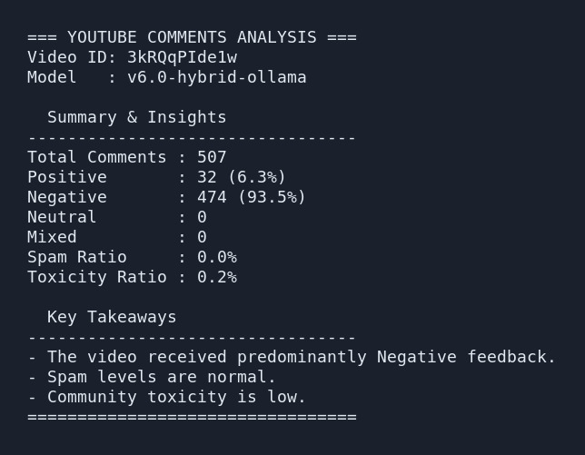

# youtube-comments-scraper
A powerful YouTube comments scraper and hybrid sentiment analyzer specifically tuned for English and Indonesian languages.


> **Demo / Screenshot**
> 

## Description
Analyzing YouTube comments manually can be overwhelming, especially for videos with thousands of interactions. This tool automates the extraction and analysis of YouTube comments, providing deep, actionable insights into audience sentiment. It combines a lexicon-based approach, localized HuggingFace transformer models (SST-2 for English, BERT for Indonesian), and local Ollama Qwen2.5 for accuracy verification. Built-in spam and toxicity filters ensure the resulting data is clean and highly relevant.

## Features
- **Data Scraping**: Fetches top-level comments and replies using the official YouTube Data API v3.
- **Hybrid Sentiment Analysis**: Uses HuggingFace Transformers (SST-2 for English, BERT-multilingual for Indonesian), Lexicon-based fallbacks, and Ollama Qwen2.5 for accuracy verification.
- **Spam & Toxicity Detection**: Built-in detection for spam URLs/keywords and toxic vocabulary.
- **Rich Markdown Reports**: Generates a detailed report with actionable insights, summary metrics, and full data export to markdown.

## Tech Stack
- **Runtime**: [Bun](https://bun.sh) & TypeScript
- **Machine Learning**: `@xenova/transformers`, `sentiment` (Lexicon), Local Ollama (qwen2.5:1.5b)
- **Language Detection & Preprocessing**: `franc-min`, `emoji-emotion`

## Prerequisites
- **Bun**: v1.0 or higher.
- **Ollama**: Running locally with the `qwen2.5:1.5b` model (`ollama run qwen2.5:1.5b`).
- **YouTube Data API Key**: A valid API key from Google Cloud Console.

## Installation
1. Clone the repository:
   ```bash
   git clone https://github.com/belajarcarabelajar/youtube-comments-scraper.git
   cd youtube-comments-scraper
   ```
2. Install dependencies:
   ```bash
   bun install
   ```

## Configuration
Create a `.env` file in the root directory and add your YouTube API Key:
```env
YOUTUBE_API_KEY=your_api_key_here
```
> **Warning**: Do not commit the `.env` file. It is already added to `.gitignore`.

## Usage
Run the script by providing a YouTube Video ID. You can also specify the maximum number of comment pages to fetch (default is 5).

```bash
bun run src/index.ts --videoId=5bKxkW_z408 --maxPages=2
```

### Example Output (Terminal)
```text
Starting comment collection for Video ID: 5bKxkW_z408...

=== SENTIMENT RECAP ===
Macro F1 requirement: Check test suite (rtk bun test)
Total Comments: 125
Positive: 80
Negative: 15
Neutral: 20
Mixed: 0
Spam: 8
Toxic: 2
=======================
Full markdown report saved to: /mnt/c/Users/Tedi Rahmat/Downloads/comments_5bKxkW_z408.md
```

## Project Structure
```text
youtube-comments-scraper/
├── src/
│   ├── index.ts           # Main scraper and analyzer script
│   ├── index.test.ts      # Test suite for sentiment and scraping logic
│   └── lexicons.ts        # Indonesian slang, toxic, and positive/negative lexicons
├── docs/                  # API, architecture, and Claude documentation
├── audit-reports/         # Production-readiness audit reports and findings
├── package.json           # Dependencies and scripts
├── tsconfig.json          # TypeScript configuration
├── bun.lock               # Bun lockfile
├── .env                   # Environment variables (API Key)
└── local_models/          # Cached transformer models
```

## Contributing
Contributions are welcome! Please open an issue or submit a Pull Request if you'd like to improve the sentiment accuracy, add support for more languages, or optimize the scraping process.

## API Reference / Internal Methods
While primarily a CLI tool, the core logic is structured to be modular. Key components inside `src/index.ts` such as sentiment analysis pipelines and markdown report generators can potentially be exported. 

### `preprocess(text: string)`
Cleans and normalizes the input text by stripping URLs, converting emojis to text labels, and handling repeating characters.
- **Returns**: `{ normalized: string, urls: string[] }`

### `analyzeComment(text: string)`
Performs hybrid sentiment analysis (Transformers, Lexicon, and Ollama verification) as well as spam and toxicity checks.
- **Returns**: `Promise<{ score: number, confidence: number, label: string, isSpam: boolean, isToxic: boolean, reasoning: string }>`

### `fetchWithRetry(url: string, retries?: number, backoff?: number)`
A robust internal network fetch handler that automatically retries API requests on network errors or 500-level HTTP responses with exponential backoff.
- **Returns**: `Promise<any>`

### `processComment(id: string, snippet: any)`
Processes a raw YouTube comment snippet, invokes the preprocessing and analyzer pipelines, and formats the result into a clean `CommentData` object.
- **Returns**: `Promise<CommentData>`

## Acknowledgements
- [Bun](https://bun.sh) for the incredibly fast TS runtime.
- [Ollama](https://ollama.com/) & [Qwen2.5](https://qwenlm.github.io/) for advanced NLP sentiment verification.
- [HuggingFace Transformers](https://huggingface.co/docs/transformers/index) via `@xenova/transformers` for local ML inference.
- YouTube Data API v3 for the data infrastructure.

## License
MIT License
